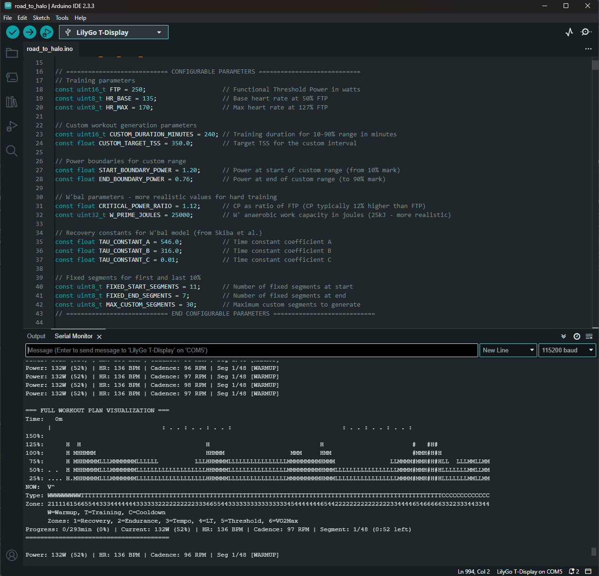

# ESP32 BLE Cycling Emulator for Zwift v0.2.32

An advanced Bluetooth Low Energy (BLE) emulator for Zwift running on ESP32, featuring intelligent workout generation with physiological constraints and real-time visualization.



## Features

### Core Functionality
- **Complete Smart Trainer Emulation**: Simulates "Kickr Core 5638" with all three services:
  - Cycling Power Service (dynamic workout-based power)
  - Cycling Speed and Cadence Service (90-98 RPM with realistic behavior)
  - Heart Rate Service (physiologically accurate HR based on power output)

### Advanced Workout Generation
- **Intelligent TSS-Targeted Training**: Generates custom workouts to hit specific Training Stress Score targets
- **W'bal Constraint System**: Respects anaerobic work capacity for physiologically realistic intervals
- **Multi-Phase Structure**:
  - Fixed warmup sequence (10% of workout)
  - Dynamic training intervals with varied intensities (80% of workout)
  - Structured cooldown progression (10% of workout)

### Real-Time Visualization
- **ASCII Workout Profile**: 120-character wide visualization showing power zones over time
- **Live Progress Tracking**: Current position marker with segment information
- **Power Zone Display**: Visual representation of training zones (Recovery to VO2 Max)
- **Detailed Segment Info**: Duration, power targets, and workout type for each interval

## Configuration Parameters

### Training Parameters
```cpp
const uint16_t FTP = 250;                     // Functional Threshold Power in watts
const uint8_t HR_BASE = 135;                  // Base heart rate at 50% FTP
const uint8_t HR_MAX = 170;                   // Max heart rate at 127% FTP
```

### Workout Generation
```cpp
const uint16_t CUSTOM_DURATION_MINUTES = 240; // Total training duration (10-90% range)
const float CUSTOM_TARGET_TSS = 350.0;        // Target Training Stress Score
const float START_BOUNDARY_POWER = 1.20;      // Power at start of main set (120% FTP)
const float END_BOUNDARY_POWER = 0.76;        // Power at end of main set (76% FTP)
```

### Physiological Constraints
```cpp
const float CRITICAL_POWER_RATIO = 1.12;      // Critical Power as ratio of FTP
const uint32_t W_PRIME_JOULES = 25000;        // Anaerobic work capacity (25kJ)
```

## Parameter Effects

### FTP (Functional Threshold Power)
- **Base for all calculations**: All power targets are calculated as percentages of FTP
- **Heart rate scaling**: Determines HR response curve (50% FTP = HR_BASE, 127% FTP = HR_MAX)
- **Recommended range**: 150-400W depending on fitness level

### Target TSS
- **Workout intensity**: Higher TSS = more time at higher intensities
- **Duration relationship**: TSS/hour typically ranges from 60 (easy) to 150+ (very hard)
- **Examples**:
  - TSS 200/4h = moderate endurance (IF ~0.63)
  - TSS 350/4h = hard training (IF ~0.76)
  - TSS 500/4h = very hard/racing (IF ~0.91)

### W' (Anaerobic Work Capacity)
- **High-intensity limits**: Constrains duration and frequency of supra-threshold efforts
- **Recovery modeling**: Determines how quickly you can repeat hard intervals
- **Typical values**: 15-35kJ (higher = more anaerobic capacity)

### Critical Power Ratio
- **Sustainable threshold**: Power you can theoretically hold indefinitely
- **Typically 106-115% of FTP**: Higher ratios allow more aggressive interval prescription
- **Training focus**: Lower ratios emphasize aerobic development, higher ratios allow more VO2 work

## Installation

1. **Arduino IDE Setup**:
   ```
   File → Preferences → Additional Board Manager URLs:
   https://raw.githubusercontent.com/espressif/arduino-esp32/gh-pages/package_esp32_index.json

   Tools → Board → Boards Manager → Search "ESP32" → Install
   ```

2. **Required Libraries**:
   - ESP32 BLE Arduino (usually included with ESP32 board package)
   - No additional libraries needed

3. **Upload Process**:
   - Connect ESP32 via USB
   - Select board type and port in Arduino IDE
   - Compile and upload the sketch

## Usage

### Initial Setup
1. Power on ESP32 and open Serial Monitor (115200 baud)
2. Device will generate custom workout and display configuration
3. Look for "BLE emulator ready for Zwift connection!"

### Zwift Pairing
1. Open Zwift and navigate to pairing screen
2. Look for "Kickr Core 5638" in all three categories:
   - Power Source
   - Cadence Source
   - Heart Rate Monitor
3. Pair all three services and start riding

### Workout Monitoring
- **Serial Output**: Real-time power, HR, cadence, and segment information
- **Workout Visualization**: ASCII graph updates every minute showing full workout profile
- **Progress Tracking**: Current position, remaining time, and zone information

### Workout Lifecycle
- **Automatic Start**: Workout begins immediately upon ESP32 boot/reset
- **Completion Behavior**: After workout ends:
  - Power and cadence drop to 0 (simulates stopping pedaling)
  - Heart rate gradually decreases to 90 BPM over 5 minutes (realistic recovery)
  - System maintains final state indefinitely
- **New Workout**: To start fresh workout, physically reset ESP32 (reset button or power cycle)
- **No Remote Restart**: No built-in mechanism to restart workout without hardware reset

## Workout Structure

### Phase 1: Warmup (10% duration)
- Progressive warmup with varied intensities
- Includes short high-intensity priming efforts
- Prepares body for main training block

### Phase 2: Main Set (80% duration)
- **Intensity Distribution**:
  - 20% recovery/endurance (45-65% FTP)
  - 40% tempo/threshold (75-105% FTP)
  - 30% VO2/anaerobic (110-130% FTP)
  - 10% neuromuscular (130%+ FTP)
- **Segment Strategy**:
  - Short segments (2-8min): High intensity focus
  - Medium segments (8-15min): Threshold/VO2 work
  - Long segments (15-20min): Sustainable intensities

### Phase 3: Cooldown (10% duration)
- Structured progression from training intensity to recovery
- Gradual power reduction over multiple segments
- Ends with easy spinning

## Customization Examples

### Endurance Ride (TSS 180, 3 hours)
```cpp
const uint16_t CUSTOM_DURATION_MINUTES = 180;
const float CUSTOM_TARGET_TSS = 180.0;
// Results in mostly Zone 2-3 riding with occasional tempo efforts
```

### VO2 Max Session (TSS 120, 1.5 hours)
```cpp
const uint16_t CUSTOM_DURATION_MINUTES = 90;
const float CUSTOM_TARGET_TSS = 120.0;
// Creates high-intensity interval structure
```

### Race Simulation (TSS 280, 2 hours)
```cpp
const uint16_t CUSTOM_DURATION_MINUTES = 120;
const float CUSTOM_TARGET_TSS = 280.0;
// Generates race-like variable power with high average
```

## Troubleshooting

### Connection Issues
- **Device not visible**: Check ESP32 power and Serial Monitor for startup messages
- **Pairing fails**: Restart Bluetooth on Zwift device, ensure close proximity
- **Disconnections**: Check power supply stability, avoid interference sources

### Workout Issues
- **Unrealistic TSS**: Check if target TSS matches duration (TSS/hour should be 50-150)
- **Too easy/hard**: Adjust FTP setting to match your actual threshold power
- **W'bal errors**: Reduce W_PRIME_JOULES or increase CRITICAL_POWER_RATIO if issues persist

## Version History

### v0.2.32 (Current)
**Major Rewrite with Advanced Features**

#### New Features:
- **Intelligent Workout Generation**: TSS-targeted custom workouts with physiological constraints
- **W'bal Modeling**: Anaerobic work capacity limits prevent unrealistic interval prescriptions
- **Real-time Visualization**: 120-character ASCII workout profile with live progress tracking
- **Multi-phase Structure**: Warmup/training/cooldown with seamless transitions
- **Power Zone Display**: Visual representation of training intensity zones
- **Enhanced Configurability**: Detailed parameter control for training customization

#### Technical Improvements:
- **Realistic Power Distribution**: Strategic intensity allocation based on segment duration
- **Physiological HR Modeling**: Heart rate response based on actual power output vs fixed ranges
- **TSS Accuracy**: Mathematical correction ensures target TSS within ±5%
- **Memory Management**: Dynamic allocation for variable workout lengths
- **Improved BLE Stability**: Enhanced connection handling and data formatting

#### Mathematical Enhancements:
- **Proper TSS Calculation**: IF² weighting for accurate training load measurement
- **W'bal Recovery Modeling**: Exponential recovery below CP, linear depletion above
- **Smart Normalization**: Post-generation TSS correction while maintaining physiological feasibility
- **Intensity Stratification**: Duration-based power targeting for realistic interval distribution

### v0.1.09 (Previous)
**Simple BLE Emulator**

#### Features:
- Basic BLE services (Power, Cadence, Heart Rate)
- Fixed cycling ranges:
  - Power: 200-220W
  - Cadence: 90-98 RPM
  - Heart Rate: 135-155 BPM
- Simple value oscillation
- Basic Zwift compatibility

#### Limitations:
- No workout structure
- Fixed power output regardless of training goals
- No physiological modeling
- Limited configurability
- No visualization or progress tracking

## License

This project is released under the MIT License.

## Health and Safety Notice

This emulator is designed for training simulation and testing purposes. Always:
- Consult with qualified fitness professionals for training program design
- Listen to your body and adjust intensity based on perceived exertion
- Ensure proper bike fit and safety equipment when training
- Stay hydrated and maintain appropriate training environment
- Seek medical advice before beginning any new exercise program

The generated workouts are mathematical models and may not suit all fitness levels or health conditions.